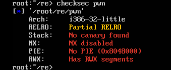
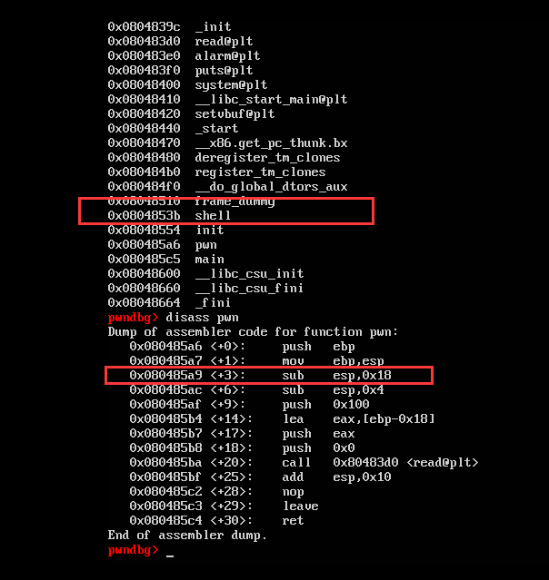

# 赛题设计说明

## 题目信息：

* 题目名称：easy_pwn
* 预估难度：简单 （简单/中等偏易/中等偏难/困难）
* 编译命令：gcc pwn.c -o pwn -m32 -fno-stack-protector -z execstack （根据设计填写编译命令）

## 题目描述：

> 这是一个很简单的pwn哦，相信你一定能通过自己的聪明才智获得服务器中的 flag。

## 题目考点：

1. 栈溢出
2. ret2text


## 思路简述：
一个很简单的 pwn 程序，直接栈溢出到 shell 函数即可 getshell，进而获取flag。


## 题目提示：
1. 栈溢出
2. ret2text
3. pwn函数read函数可输入超过长度的字符溢出返回地址


## 原始 flag 及更新命令：

```shell
    # 原始 flag
    flag{flag_test}
    # ..
    # 更新 flag 命令
    echo 'flag{85c2a01a-55f7-442a-8712-3f6908e1463a}' > /flag
```

## 题目环境：

1. Ubuntu 16.04 LTS
2. xinetd + chroot

## 题目制作过程：

1. 编写 pwn.c 代码，详细代码请从 “源码” 文件夹获取，
2. 编译方式在源代码第一行，
3. 编写 xinetd 配置文件，设置好参数，
4. 生成 flag 文件，flag 为 flag{3ff32148-e229-41fd-b7b9-d09e76d35daf}
5. 编写 Dockerfile。

注：如果是常规的 pwn 题，直接替换模板 docker 文件夹中的 pwn 以及 flag 文件即可，无需步骤3、4、5

## 题目 writeup：

1. 检查题目保护，发现无保护
  


2. 使用 GDB 发现 pwn 函数存在栈溢出，且溢出长度为 0x18 + 0x04(ebp)



3. 编写 exp.py ，获取flag，详细代码请从 “exp脚本” 文件夹获取

注：如果 writeup 无法清楚描述解题过程，将扣除一定得分。

## 注意事项

1. 题目名称不要有特殊符号，可用下划线代替空格；
2. 根据设计的赛题，自行完善所有文件夹中的信息；
3. 此文件夹下信息未完善的队伍，将扣除一定得分。